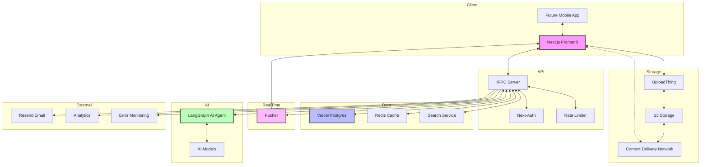

# Dexter.ai Implementation Plan

## Current Status

- **Phase**: Initial Setup
- **Progress**: 5% Complete
- **Current Focus**: Project Setup and Database Schema
- **Next Milestone**: Authentication System

## Reference Documents

- **Use Cases**: See [use-cases.md](use-cases.md) for detailed functional requirements
- **Technical Design**: See [design-doc.md](design-doc.md) for architecture and implementation details

## Tech Stack

- **Framework**: Next.js 15.2.0
- **Database**: Vercel Postgres
- **ORM**: Drizzle ORM 0.40.0
- **API Layer**: tRPC 11.0.0-rc.446
- **Authentication**: Next-Auth 5.0.0
- **File Uploads**: UploadThing 7.5.2
- **State Management**: Zustand 5.0.3
- **Real-time**: Pusher 5.2.0
- **Validation**: Zod 3.24.2
- **UI**: Tailwind CSS 4.0.9

## Step 1: Project Setup [P0] - Est. 1 day

**Progress**: 0% Complete

- [ ] Install core dependencies

  ```bash
  pnpm add next@15.2.0 react@19.0.0 react-dom@19.0.0
  pnpm add drizzle-orm@0.40.0 @vercel/postgres@0.10.0
  pnpm add @trpc/client@11.0.0-rc.446 @trpc/server@11.0.0-rc.446 @trpc/react-query@11.0.0-rc.446 @trpc/next@11.0.0-rc.446
  pnpm add @tanstack/react-query@5.66.11
  pnpm add zod@3.24.2
  pnpm add zustand@5.0.3
  pnpm add next-auth@5.0.0
  pnpm add uploadthing@7.5.2 @uploadthing/react@7.5.2
  pnpm add pusher@5.2.0 pusher-js@8.4.0
  ```

- [ ] Install dev dependencies

  ```bash
  pnpm add -D drizzle-kit@0.30.5 @tanstack/react-query-devtools@5.66.11
  pnpm add -D tailwindcss@4.0.9 postcss@8.5.3 autoprefixer@10.4.20
  pnpm add -D @types/uuid@10.0.0
  ```

- [ ] Initialize TailwindCSS

  ```bash
  npx tailwindcss init -p
  ```

- [ ] Create Vercel Postgres database and get connection details

**Testing**: Verify all dependencies install correctly and project builds without errors

## Step 2: Database Schema Setup [P0] - Est. 2 days

**Progress**: 20% Complete
**Reference**: See [Design Doc Database Schema Section](design-doc.md#database-schema)

- [x] Create `src/server/db` folder structure

  ```
  /src/server
    /db
      /schema
        /tables
          index.ts
          users.ts
          teams.ts
          messages.ts
          documents.ts
          notifications.ts
        /relations
          index.ts
        /types
          index.ts
        enums.ts
        index.ts
        config.ts
      index.ts
  ```

- [ ] Define database schema in `src/server/db/schema/` files:

  - [x] `users.ts`: User model with Next-Auth integration
  - [x] `teams.ts`: Teams and team members
  - [x] `messages.ts`: Messages and message mentions
  - [x] `documents.ts`: Documents, versions, and access
  - [x] `notifications.ts`: Notification system
  - [x] `enums.ts`: Implement enums for statuses and roles

- [x] Setup Drizzle configuration and client in `src/server/db/index.ts`

  - [x] Configure Vercel Postgres connection
  - [x] Export DB client

- [ ] Configure Drizzle push for schema synchronization (no migrations)
  ```bash
  pnpm add -D drizzle-kit
  ```
  - [ ] Create script for pushing schema changes to the database
  ```json
  "scripts": {
    "db:push": "drizzle-kit push:pg"
  }
  ```

**Testing**:

- Unit tests for schema validation
- Verify schema push works correctly
- Test foreign key constraints

## Step 3: Authentication with Next-Auth [P0] - Est. 2 days

**Progress**: 0% Complete
**Reference**: See [Design Doc Authentication Section](design-doc.md#11-registration-and-authentication)

- [ ] Set up Next-Auth

  - [ ] Create authentication configuration in `src/app/api/auth/[...nextauth]/route.ts`
  - [ ] Implement OAuth providers (Google, GitHub)
  - [ ] Set up session management
  - [ ] Configure Drizzle adapter for Next-Auth

- [ ] Implement auth-related components
  - [ ] Login form
  - [ ] Registration form
  - [ ] Password reset flow
  - [ ] Session provider in layout

**Testing**:

- Test user registration flow
- Test login with each OAuth provider
- Test session persistence
- Test password reset flow

## Step 4: tRPC Setup [P0] - Est. 1 day

**Progress**: 0% Complete

- [ ] Set up tRPC infrastructure

  - [x] Create `src/server/trpc.ts` for context and procedure helpers
  - [x] Implement tRPC router in `src/server/index.ts`
  - [x] Set up tRPC client provider
  - [x] Create API handler at `src/app/api/trpc/[trpc]/route.ts`

- [ ] Implement router modules
  - [ ] User router
  - [ ] Team router (See [Use Case 2.1-2.3](use-cases.md#21-team-creation))
  - [ ] Conversation router
  - [ ] Message router
  - [ ] Document router (See [Use Case 3.1-3.4](use-cases.md#31-document-uploadgeneration))
  - [ ] Notification router (See [Use Case 4.1-4.3](use-cases.md#41-user-mention-in-message))

**Testing**:

- Test API endpoints with Postman/Insomnia
- Verify error handling
- Test authentication integration

## Step 5: File Upload System (UploadThing) [P1] - Est. 1 day

**Progress**: 0% Complete
**Reference**: See [Design Doc Document Management Section](design-doc.md#41-document-creation-and-versioning)

- [ ] Set up UploadThing for document uploads

  - [ ] Create `src/app/api/uploadthing/core.ts`

    ```typescript
    import { createUploadthing, type FileRouter } from "uploadthing/next";
    import { getServerSession } from "next-auth";
    import { authOptions } from "@/app/api/auth/[...nextauth]/route";

    const f = createUploadthing();

    const auth = async (req: Request) => {
      const session = await getServerSession(authOptions);
      if (!session) throw new Error("Unauthorized");
      return session.user;
    };

    export const uploadRouter = {
      documentUploader: f({
        pdf: { maxFileSize: "16MB" },
        text: { maxFileSize: "2MB" },
        image: { maxFileSize: "4MB" },
      })
        .middleware(async ({ req }) => {
          const user = await auth(req);
          return { userId: user.id };
        })
        .onUploadComplete(async ({ metadata, file }) => {
          console.log("Upload complete for userId:", metadata.userId);
          return { uploadedBy: metadata.userId, fileUrl: file.url };
        }),
    } satisfies FileRouter;

    export type OurFileRouter = typeof uploadRouter;
    ```

  - [ ] Create `src/app/api/uploadthing/route.ts`

    ```typescript
    import { createRouteHandler } from "uploadthing/next";
    import { uploadRouter } from "./core";

    export const { GET, POST } = createRouteHandler({
      router: uploadRouter,
    });
    ```

  - [ ] Create client-side components for file uploads

**Testing**:

- Test file upload with various file types
- Test file size limits
- Verify metadata is correctly associated with uploads

## Step 6: Zustand Store Setup [P1] - Est. 1 day

**Progress**: 0% Complete

- [ ] Create Zustand stores for client state
  - [ ] `src/stores/notifications.ts`: Local notification state
  - [ ] `src/stores/ui.ts`: UI state (selected conversations, etc.)

**Testing**:

- Test state persistence
- Test state updates
- Verify store integration with components

## Step 7: User & Team Management [P0] - Est. 3 days

**Progress**: 0% Complete
**Reference**: See [Use Case 2.1-2.3](use-cases.md#21-team-creation) and [Design Doc Team Collaboration Section](design-doc.md#21-team-creation-and-management)

- [ ] Implement user functionality

  - [ ] User profile page
  - [ ] User settings
  - [ ] tRPC procedures for user-related operations

- [ ] Implement team functionality
  - [ ] Team creation
  - [ ] Team joining
  - [ ] Team member management
  - [ ] tRPC procedures for team operations

**Testing**:

- Test team creation flow
- Test team invitation process
- Test role-based permissions
- Test team member management

## Step 8: Conversations & Messaging [P0] - Est. 4 days

**Progress**: 0% Complete
**Reference**: See [Design Doc Conversations and Messaging Section](design-doc.md#31-conversation-types)

- [ ] Implement conversation system

  - [ ] Create conversation components
  - [ ] Implement private conversations
  - [ ] Implement team conversations
  - [ ] Add conversation tRPC procedures

- [ ] Implement messaging system

  - [ ] Message components
  - [ ] Message input with @mentions (See [Use Case 4.1](use-cases.md#41-user-mention-in-message))
  - [ ] AI integration with @dexter mentions
  - [ ] Message tRPC procedures

- [ ] Implement streamed AI responses

  - [ ] Create a streaming tRPC procedure for AI messages

    ```typescript
    export const messageRouter = createTRPCRouter({
      streamAiResponse: publicProcedure
        .input(
          z.object({
            conversationId: z.string().uuid(),
            prompt: z.string(),
          })
        )
        .subscription(async ({ input, ctx }) => {
          // Verify user is in conversation
          const isParticipant = await verifyParticipant(ctx.user.id, input.conversationId);
          if (!isParticipant) throw new TRPCError({ code: "FORBIDDEN" });

          return observable<{ content: string; isComplete: boolean }>((emit) => {
            // Call your AI service with streaming support
            const stream = getAiStream(input.prompt);

            // Handle streaming chunks
            stream.on("data", (chunk) => {
              emit.next({ content: chunk.toString(), isComplete: false });
            });

            stream.on("end", () => {
              emit.next({ content: "", isComplete: true });
              emit.complete();
            });

            return () => {
              // Cleanup if client disconnects
              stream.destroy();
            };
          });
        }),
    });
    ```

  - [ ] Create UI components for displaying streaming responses
  - [ ] Implement loading states and typing indicators

- [ ] Set up Pusher for real-time messaging
  - [ ] Create Pusher client config
  - [ ] Set up message subscription
  - [ ] Trigger message events

**Testing**:

- Test message sending/receiving
- Test real-time updates
- Test @mentions functionality
- Test AI response streaming
- Load testing for concurrent messages

## Step 9: Document Management [P0] - Est. 4 days

**Progress**: 0% Complete
**Reference**: See [Use Case 3.1-3.4](use-cases.md#31-document-uploadgeneration) and [Design Doc Document Management Section](design-doc.md#41-document-creation-and-versioning)

- [ ] Implement document upload & storage

  - [ ] Document upload components using UploadThing
  - [ ] Document list view
  - [ ] Document version tracking (new upload = new version)
  - [ ] tRPC procedures for document operations

- [ ] Document sharing

  - [ ] Implement review request system (See [Use Case 3.2](use-cases.md#32-request-document-review))
  - [ ] Document mention system in conversations (See [Use Case 4.2](use-cases.md#42-document-mention-in-message))
  - [ ] Document access control (See [Use Case 5.1-5.2](use-cases.md#51-document-access-grant))

- [ ] AI document generation
  - [ ] Document generation form
  - [ ] AI integration (See [Use Case 6.1](use-cases.md#61-ai-document-generation))
  - [ ] tRPC procedures for document generation

**Testing**:

- Test document upload/download
- Test version control
- Test access control permissions
- Test review workflow
- Test AI document generation

## Step 10: Notification System [P1] - Est. 2 days

**Progress**: 0% Complete
**Reference**: See [Use Case 4.1-4.3](use-cases.md#41-user-mention-in-message) and [Design Doc Notification System Section](design-doc.md#61-notification-system)

- [ ] Implement notification components

  - [ ] Notification list
  - [ ] Notification badge
  - [ ] Mark as read functionality

- [ ] Set up non-blocking notifications using waitUntil

  ```typescript
  // In a tRPC procedure (STILL TO BE TESTED)
  createNotification: protectedProcedure
    .input(z.object({
      recipientId: z.string().uuid(),
      eventType: z.string(),
      resourceType: z.string(),
      resourceId: z.string().uuid(),
    }))
    .mutation(async ({ input, ctx }) => {
      // Primary operation - respond quickly to client
      const result = { success: true };

      // Non-blocking background operation
      ctx.waitUntil(
        (async () => {
          try {
            // Create notification in database
            await ctx.db.insert(notifications).values({
              senderId: ctx.user.id,
              recipientId: input.recipientId,
              eventType: input.eventType,
              resourceType: input.resourceType,
              resourceId: input.resourceId,
              isRead: false,
              createdAt: new Date(),
            });

            // Trigger real-time notification via Pusher
            await ctx.pusher.trigger(
              `user-${input.recipientId}`,
              'new-notification',
              {
                senderId: ctx.user.id,
                eventType: input.eventType,
                resourceType: input.resourceType,
                resourceId: input.resourceId,
              }
            );
          } catch (error) {
            console.error('Failed to process notification:', error);
          }
        })()
      );

      return result;
    }),
  ```

- [ ] Set up notification triggers

  - [ ] Conversation mentions
  - [ ] Document sharing
  - [ ] Review requests

- [ ] Real-time notifications with Pusher
  - [ ] Configure notification channels
  - [ ] Subscribe to user-specific notifications

**Testing**:

- Test notification creation
- Test real-time delivery
- Test notification UI components
- Test mark as read functionality

## Step 11: UI/UX Implementation [P1] - Est. 5 days

**Progress**: 0% Complete

- [ ] Create layout and navigation

  - [ ] Main dashboard layout
  - [ ] Navigation sidebar
  - [ ] Responsive design

- [ ] Implement core views
  - [ ] Dashboard
  - [ ] Team view
  - [ ] Conversation view
  - [ ] Document view
  - [ ] Notification center

**Testing**:

- Test responsive design on various devices
- Test accessibility compliance
- Test navigation flows
- User testing for UX feedback

## Step 12: Testing & Optimization [P0] - Est. 3 days

**Progress**: 0% Complete

- [ ] Add unit tests for core functionality

  - [ ] Authentication tests
  - [ ] Database operation tests
  - [ ] API endpoint tests
  - [ ] Component tests

- [ ] Add integration tests for user flows

  - [ ] End-to-end user registration flow
  - [ ] Team creation and management flow
  - [ ] Document upload and sharing flow
  - [ ] Conversation and messaging flow

- [ ] Performance optimization
  - [ ] Query optimization
  - [ ] Component memoization
  - [ ] Code splitting
  - [ ] Image optimization
  - [ ] API response caching

**Testing**:

- Run performance benchmarks
- Test load handling
- Verify test coverage meets requirements (>80%)

## Step 13: Deployment [P0] - Est. 2 days

**Progress**: 0% Complete

- [ ] Set up CI/CD pipeline

  - [ ] GitHub Actions workflow
  - [ ] Automated testing
  - [ ] Deployment triggers

- [ ] Deploy environments

  - [ ] Development environment
  - [ ] Staging environment
  - [ ] Production environment

- [ ] Configure environment variables

  - [ ] Database connection
  - [ ] Authentication secrets
  - [ ] API keys
  - [ ] Feature flags

- [ ] Set up monitoring and error tracking
  - [ ] Error logging
  - [ ] Performance monitoring
  - [ ] Usage analytics

**Testing**:

- Verify deployment pipeline
- Test environment configuration
- Verify monitoring systems

## Step 14: Documentation [P1] - Est. 2 days

**Progress**: 0% Complete

- [ ] Create user documentation

  - [ ] User guide
  - [ ] Feature tutorials
  - [ ] FAQ section

- [ ] Create developer documentation

  - [ ] Setup guide
  - [ ] Architecture overview
  - [ ] Contribution guidelines

- [ ] Document API and data models
  - [ ] API reference
  - [ ] Database schema documentation
  - [ ] Authentication flows

**Testing**:

- Review documentation for accuracy
- Test documentation examples

## Deployment Milestones

### Alpha Release (Internal Testing)

- Target Date: [TBD]
- Required Features:
  - Basic authentication
  - Team creation
  - Document upload
  - Simple messaging

### Beta Release (Limited Users)

- Target Date: [TBD]
- Required Features:
  - All core features from steps 1-10
  - Basic UI implementation
  - Initial performance optimization

### Production Release

- Target Date: [TBD]
- Required Features:
  - All features complete
  - Comprehensive testing
  - Documentation complete
  - Performance benchmarks met

## Performance Benchmarks

- Page load time: < 2 seconds
- API response time: < 200ms
- Real-time message delivery: < 500ms
- Document upload (5MB): < 3 seconds
- Concurrent users supported: 1000+

## Future Architecture Enhancements

As the application scales, the following architectural enhancements should be considered:

### 1. Caching Layer

Implement Redis caching for:

- Frequently accessed user data
- Team membership information
- Document access permissions
- Conversation participants

**Priority**: Medium
**Estimated Effort**: 3 days

### 2. Search Service

Add a search service (like Algolia or Elasticsearch) for:

- Document content search
- Message search across conversations
- User and team search

**Priority**: High
**Estimated Effort**: 5 days

### 3. Monitoring and Analytics

Implement monitoring and analytics services:

- Error tracking (Sentry)
- Performance monitoring (New Relic or Datadog)
- Usage analytics (Amplitude or Mixpanel)

**Priority**: Medium
**Estimated Effort**: 2 days

### 4. Rate Limiting

Implement rate limiting for API endpoints, especially for:

- Authentication attempts
- AI document generation
- Message sending

**Priority**: Low
**Estimated Effort**: 1 day

### 5. Content Delivery Network (CDN)

Implement a CDN for static assets and document delivery to improve global performance.

**Priority**: Medium
**Estimated Effort**: 2 days

### 6. Advanced Real-time Features

If Pusher limitations become an issue, consider implementing a dedicated WebSocket service.

**Priority**: Low
**Estimated Effort**: 4 days

### Target Architecture


