# Dexter.ai Sequence Diagrams

This document contains detailed sequence diagrams for the key use cases of Dexter.ai.

## Sequence Diagrams for Dexter.ai

### 1. User Authentication Flow

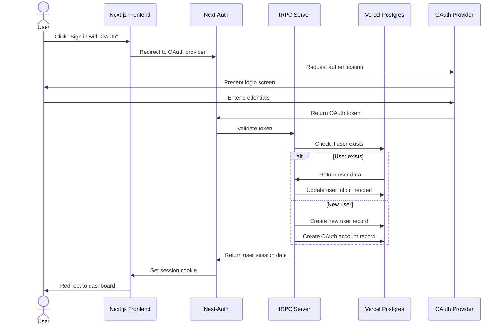

### 2. Team Creation and Management

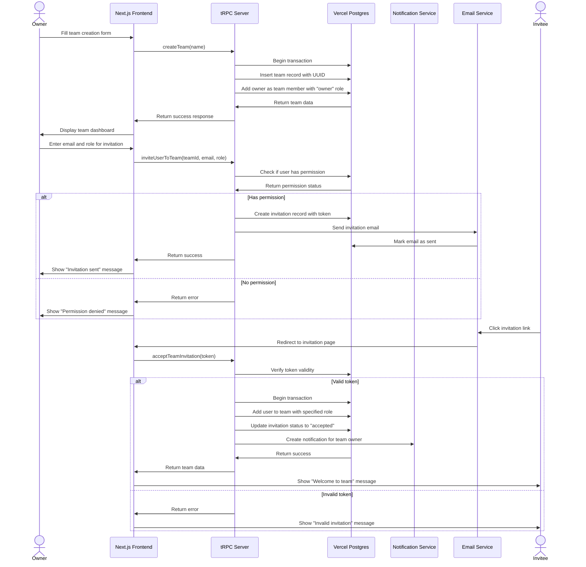

### 3. Document Upload and Version Control

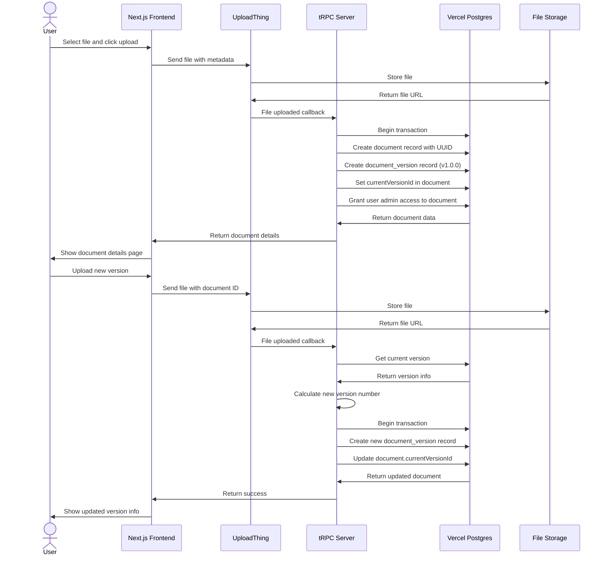

### 4. Document Review Workflow

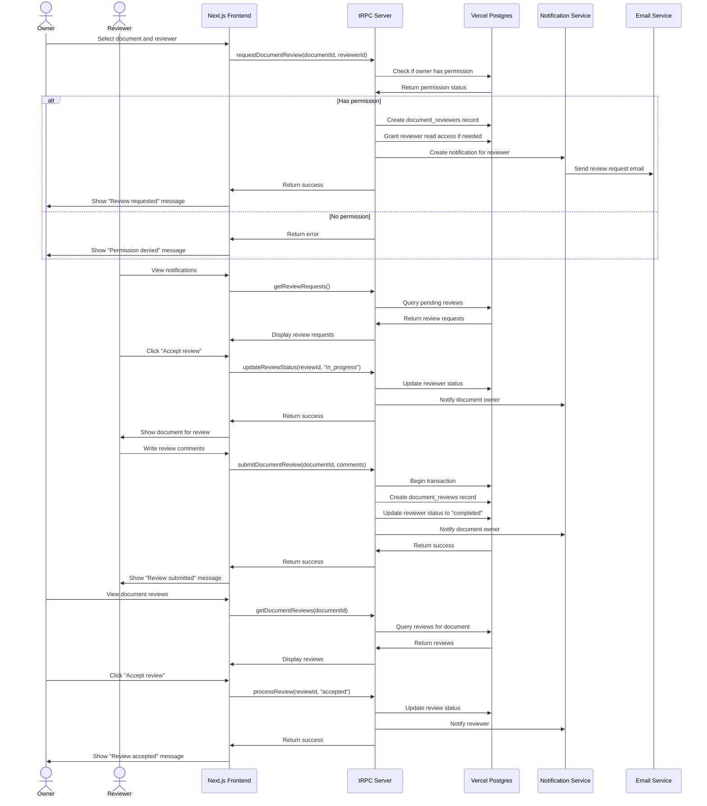

### 5. Messaging and @Mentions

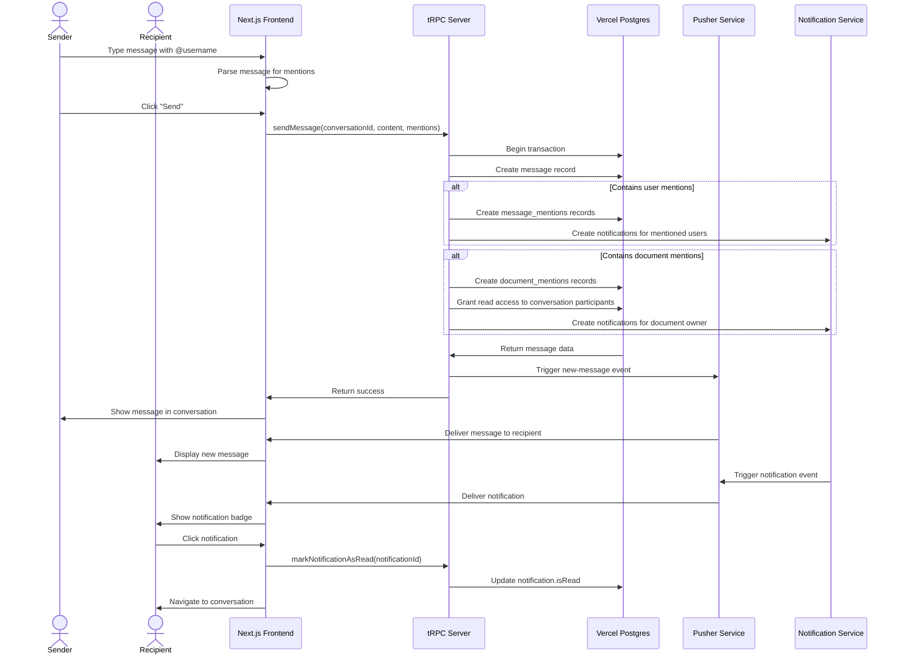

### 6. AI Document Generation

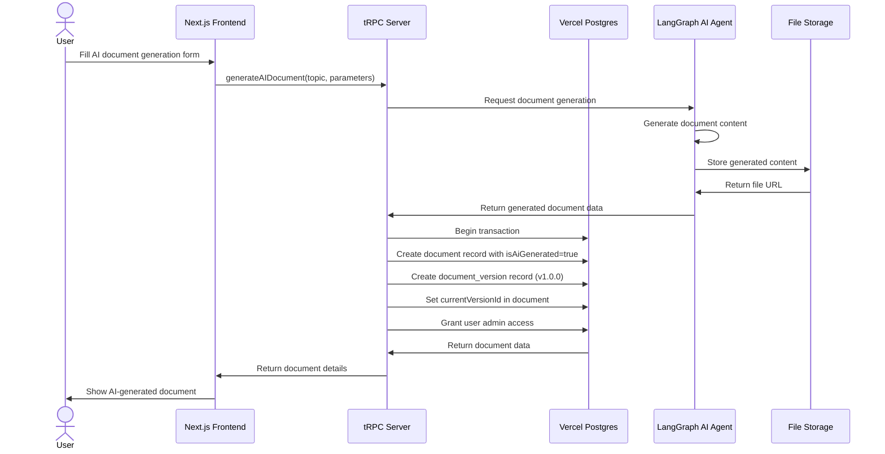

### 7. AI-Assisted Conversations

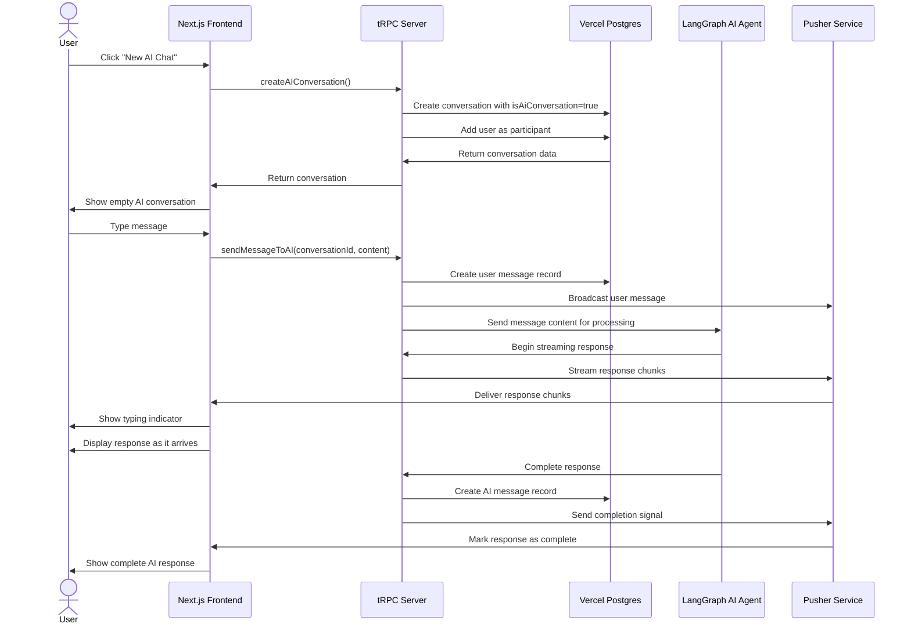

### 8. Notification System

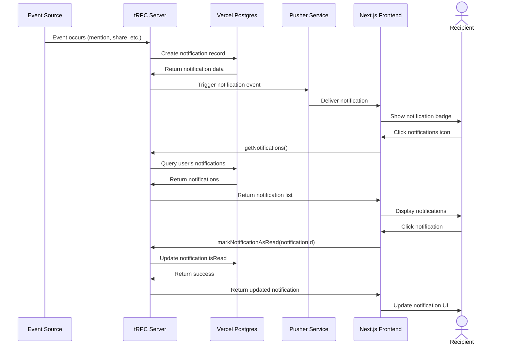

### 9. Document Access Control

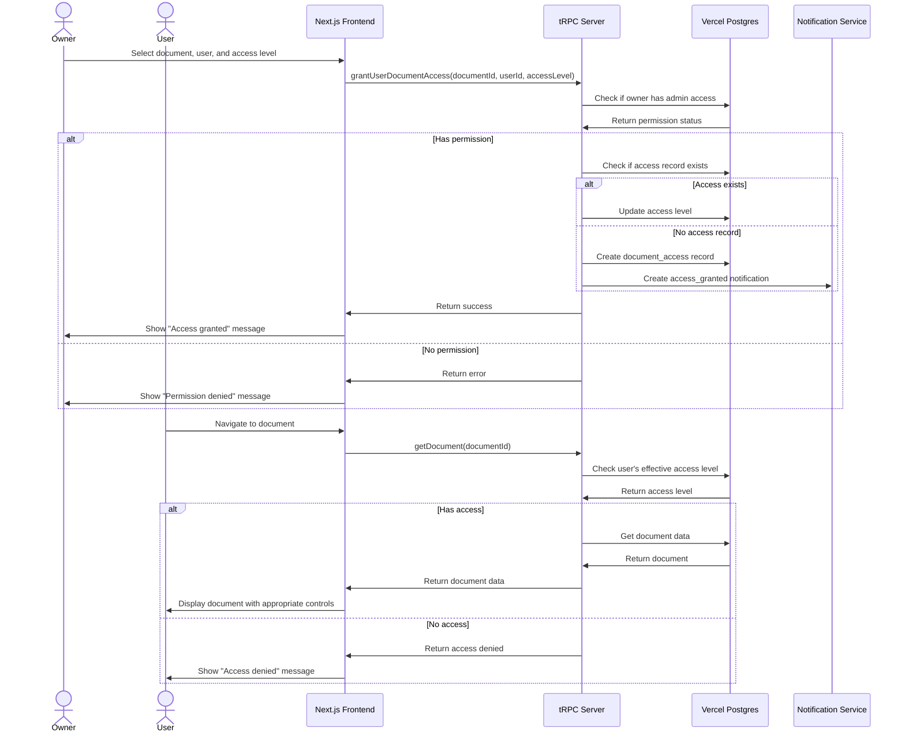

### 10. Team Channel Communication

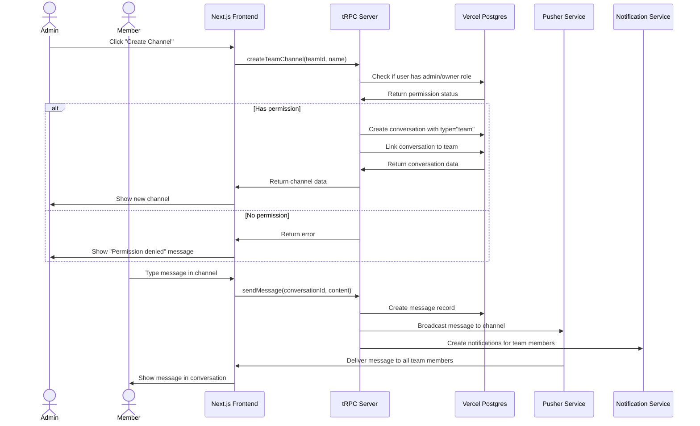

## Current Architecture

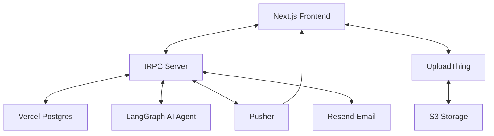

For future architecture enhancements and recommendations, please refer to the [Roadmap](roadmap.md#future-architecture-enhancements) document.
